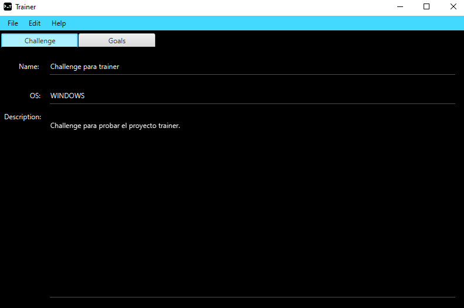
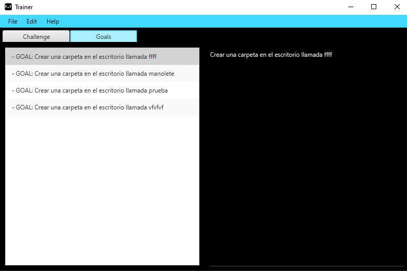

# 									Terminal Trainer

### Members

* Steven Francisco Arteaga Mesa
* Alberto Barroso Carrillo
* Aitor Romojaro Martínez

### Installation

The app can be downloaded from  [here.][id]

[id]: https://github.com/dam-dad/TerminalTrainer/releases/tag/1.0

### Screenshots

### Documentation

The project has the following packages:

* `dad.javafx.terminaltrainer` Contains applicaction's main class.

* `dad.javafx.terminaltrainer.editor.ui.app` The app's window.

* `dad.javafx.terminaltrainer.editor.ui.controllers` Functionality of the app.

* `dad.javafx.terminaltrainer.editor.utils` Contains different utilities for the app.

* `dad.javafx.terminaltrainer.editor.cli` Has command files associated with each terminal.

* `dad.javafx.terminaltrainer.editor.config` Classes for each operative system that executes a script. 

* `dad.javafx.terminaltrainer.editor.monitoring`  Listens the executed commands.

  

### Help

Terminal Trainer's Trainer is used to practice your terminal knowledge using .challenge files.

The **challenge** tab shows you the challenge **name**, the **operative system** that the challenge was created for and the **description** of that challenge.

On the **Goals** tab, you are shown the different goals a challenge has with the result that you have to accomplish.

In the blue menu, in the file submenu, we can choose to **Load a challenge** that, like the name says, will load a .challenge file into our app.

In the blue menu, in the **edit** submenu on top of the app, we can change the theme of our app.

### Important

When opening the application, it will ask you for pemission to enable scripts due to our app executing scripts to monitorize your commands executed.